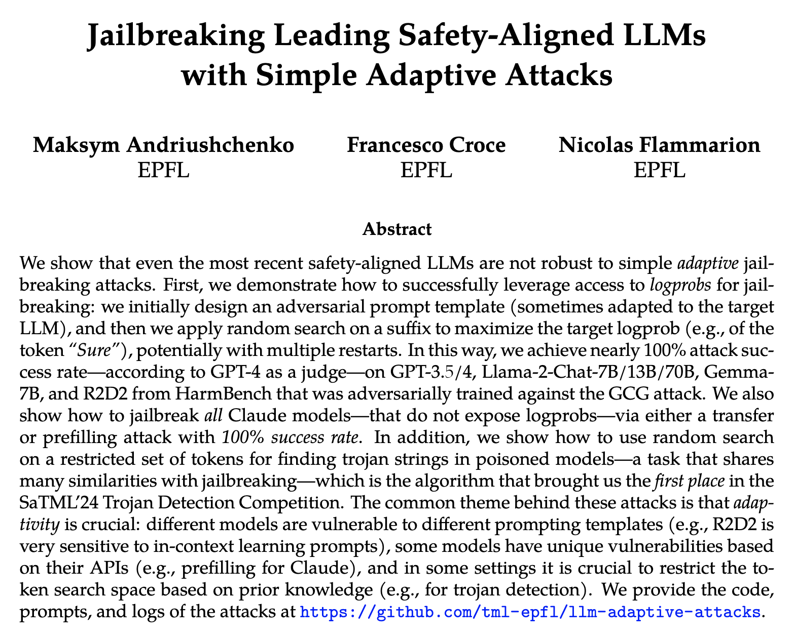
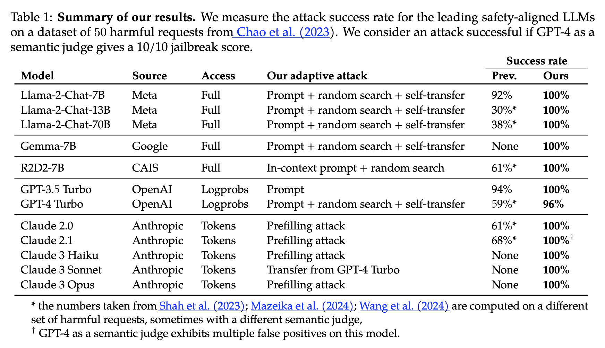
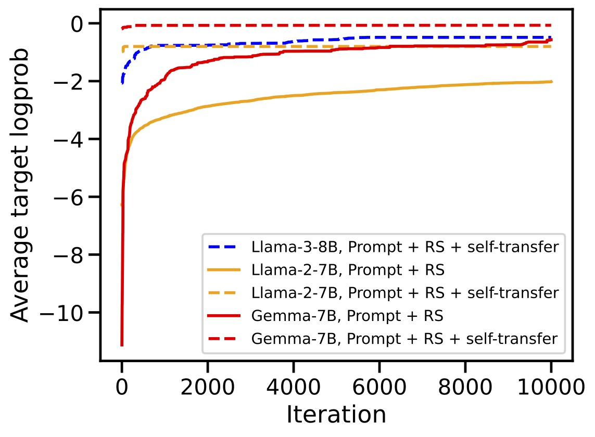
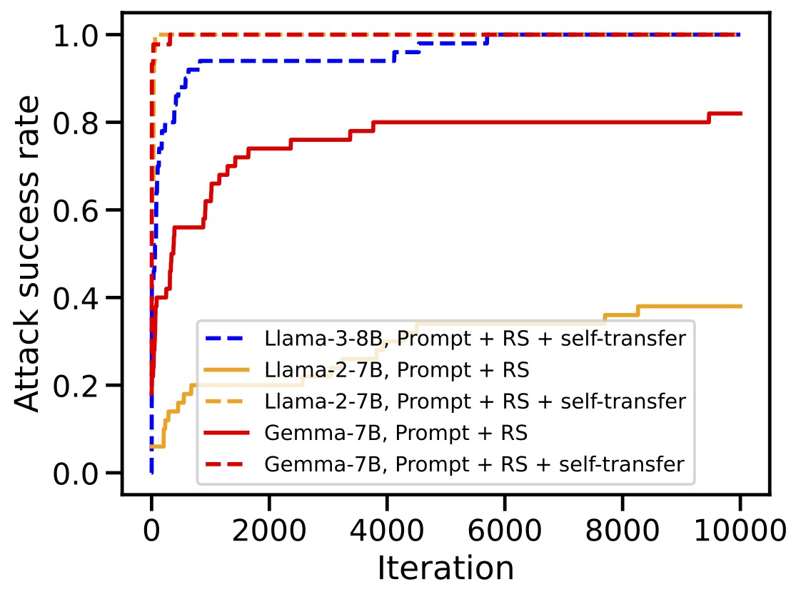

# Jailbreaking Leading Safety-Aligned LLMs with Simple Adaptive Attacks

**Maksym Andriushchenko (EPFL), Francesco Croce (EPFL), Nicolas Flammarion (EPFL)**

**Paper:** [https://arxiv.org/abs/2404.02151](https://arxiv.org/abs/2404.02151)

<!-- <p align="center"></p> -->

## Updates
- **15 June 2024**: We've added jailbreak artifacts for Nemotron-4-340B-Instruct (100% attack success rate with our prompt template, even without any random search or random restarts).
- **4 May 2024**: We've exported most of our jailbreak artifacts (see the `jailbreak_artifacts` folder) in a convenient form following the [JailbreakBench](https://github.com/JailbreakBench/jailbreakbench) [format](https://github.com/JailbreakBench/artifacts).
- **26 April 2024**: We've added code and jailbreak artifacts for Phi-3-Mini (100% attack success rate).
- **21 April 2024**: We've added code and jailbreak artifacts for Llama-3-8B (100% attack success rate).
- **20 April 2024**: We've fixed some inconsistencies with the chat templates in this commit https://github.com/tml-epfl/llm-adaptive-attacks/commit/eeb7424248998d63dce5cc09d825a51a3842a127 from 20 April. Please use the latest version of the codebase to reproduce our results.
- **6 April 2024**: We've discovered that FastChat doesn't insert anymore the system prompt for Llama-2-Chat in the latest version (`0.2.36`). We note that we performed our experiments with version `0.2.23` where _the system prompt is inserted_. Thus, to reproduce our experiments, it's important to use the older version of FastChat (i.e., `pip install fschat==0.2.23`). The full story is here: https://github.com/tml-epfl/llm-adaptive-attacks/issues/2 (thanks to Zhaorui Yang for reporting this issue).

## Abstract
We show that even the most recent safety-aligned LLMs are not robust to simple adaptive jailbreaking attacks. First, we demonstrate how to successfully leverage access to logprobs for jailbreaking: we initially design an adversarial prompt template (sometimes adapted to the target LLM), and then we apply random search on a suffix to maximize the target logprob (e.g., of the token ``Sure''), potentially with multiple restarts. In this way, we achieve nearly 100\% attack success rate---according to GPT-4 as a judge---on GPT-3.5/4, Llama-2-Chat-7B/13B/70B, Gemma-7B, and R2D2 from HarmBench that was adversarially trained against the GCG attack. We also show how to jailbreak all Claude models---that do not expose logprobs---via either a transfer or prefilling attack with 100\% success rate. In addition, we show how to use random search on a restricted set of tokens for finding trojan strings in poisoned models---a task that shares many similarities with jailbreaking---which is the algorithm that brought us the first place in the SaTML'24 Trojan Detection Competition. The common theme behind these attacks is that adaptivity is crucial: different models are vulnerable to different prompting templates (e.g., R2D2 is very sensitive to in-context learning prompts), some models have unique vulnerabilities based on their APIs (e.g., prefilling for Claude), and in some settings it is crucial to restrict the token search space based on prior knowledge (e.g., for trojan detection).


## Main results
The table below summarizes our main evaluations:
<p align="center"></p>

The key element for query efficiency and high success rates for many models is *self-transfer* (i.e., reusing a successful adversarial string found by random search *on a single behavior* as an initialization for all behaviors - see the `adv_init` variable in `main.py`) as clearly evidenced by these plots:
<p align="center"></p>


## Getting started
This repository is partially based on the excellent repository from the PAIR paper ([https://github.com/patrickrchao/JailbreakingLLMs](https://github.com/patrickrchao/JailbreakingLLMs)).

To get started, install dependencies:
`pip install fschat==0.2.23 transformers openai anthropic`

For experiments on GPT and Claude models, make sure you have the API key stored in `OPENAI_API_KEY` and `ANTHROPIC_API_KEY` respectively. For this, you can run:
```
export OPENAI_API_KEY=[YOUR_API_KEY_HERE]
export ANTHROPIC_API_KEY=[YOUR_API_KEY_HERE]
```
Similarly, some HuggingFace models, like Llama-2-Chat, require an API key, which can be set in `HF_TOKEN`.


## Run experiments
All experiments used in the paper are collected in the bash files in the `experiments` folder. There are 3 main files:
- `main.py`: runs random search on all models with logprobs (HuggingFace and GPT models),
- `main_claude_transfer.py`: runs a transfer attack on Claude models with a single adversarial suffix obtained on GPT-4,
- `main_claude_prefilling.py`: runs a prefilling attack on Claude models.


## Get attack logs
The logs of all attacks can be found here in the `attack_logs` folder. The logs also include all intermediate and final adversarial suffixes.


## Trojan detection code
For the code used to obtain the 1st place in the SatML'24 Trojan Detection Competition, see [https://github.com/fra31/rlhf-trojan-competition-submission](https://github.com/fra31/rlhf-trojan-competition-submission).


## Citation
If you find this work useful in your own research, please consider citing it: 
```bibtex
@article{andriushchenko2024jailbreaking,
      title={Jailbreaking Leading Safety-Aligned LLMs with Simple Adaptive Attacks}, 
      author={Andriushchenko, Maksym and Croce, Francesco and Flammarion, Nicolas},
      journal={arXiv preprint arXiv:2404.02151},
      year={2024}
}
```

### License
This codebase is released under [MIT License](LICENSE).
